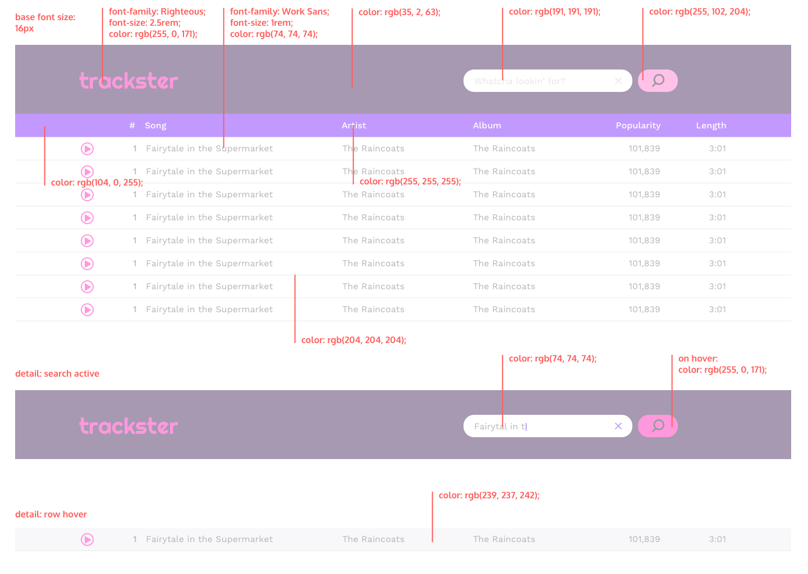

# Trackster

A Last.fm-powered music searching app.

- HTML, Bootstrap, CSS, JavaScript and jQuery.

A music search app using the Last.fm API. The app has a text input field and a search button. When a user inputs some text and clicks the button, the app will search Last.fm's database for songs related to that text. When the API request is complete, the app displays each song found in a list. The user can then listen to a sample of each song via a play button.

### Design Spec:

